# Camunda Netconf Plugins

A set of extensions for the service task in camunda to support NETCONF communication to NSO or any other netconf enabled device.
It uses the open source ANC library (https://github.com/cisco-ie/anx) to communicate over netconf.

For now 3 types of netconf specific tasks are possible:

- Netconf read config/operational
- Netconf send config
- Netconf call action

Subscribing to netconf notifications is also possible by using a configurable external subscriber which posts
events to the camunda process whenever a new notification arrives (part of another project).

Four other additional plugins which might be usefull are also available and are provided as reference:
- Send CLI command to device over NSO using live status NED feature
- REST/RESTCONF calls using the Unirest java library
- post message on KAFKA bus
- ssh plugin

# Installation

**mvn package** should generate a jar file which has to be copied in the libs directory of camunda (/camunda/server/apache.../lib)
The following additional required libraries need to be also present in the classpath - usually in the same tomcat lib dirtectory (see the versions in pom.xml)

- anc
- jsch
- unirest-java
- kafka-clients
- ganymed

There is also a json template file for the Camunda Modeler supporting all these plugins which
will provide specific templates for the Service Task. (/utils/bpmn_templates.json)

# Usage

The camunda plugins are providing 7 different element templates for the service task: 
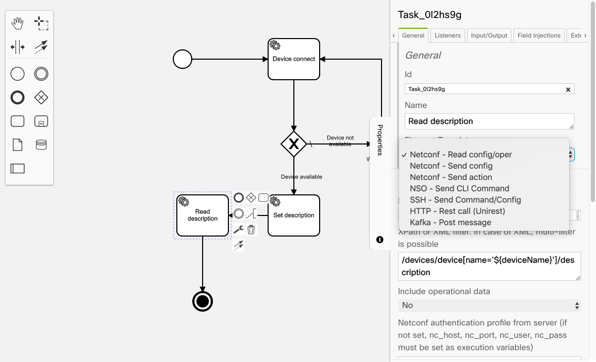

All plugins provide back to the workflow process an execution variable which contains 3 properties:
- code -  return code, depending on the plugin
- value - the returned value in case of success
- detail - detail of the error in vase it was not succesful

## Netconf/NSO plugins

### Authetication

Netconf/NSO connection credentials can be specified in 2 ways:
- using execution variables: nc_host, nc_port, nc_user, nc_pass

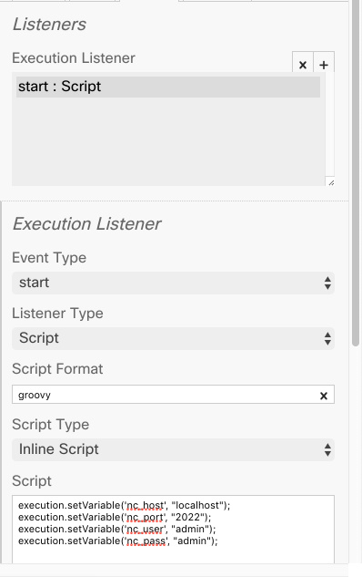

- using predefined profiles in netconf-profiles.properties (file has to be put in the camunda tomcat conf directory). Using one profile or another can be specified
on each task which requires it  - not that the profile has priority over the execution variables
One set of entries in the netconf-profiles.properties looks like:
nso1_host=localhost
nso1_port=2022
nso1_user=admin
nso1_pass=FfcZ19THZTd270glcNVGUQ==

And to use it you will need to specify the nso1 as the profile name 

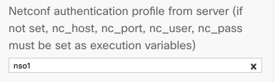

Note that password is encrypted using the provided password encryption script (**utils/passgen.sh**) and the key from the script has to match the one from the PassCrypt class

Any other authentication mechanism can be implemented depending on the use-case requirements

### 1. Netconf - Read config/oper

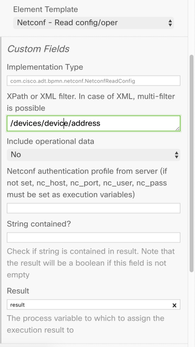

Allows to make a netconf read request for any configuration or operational data.
Need to specify
- the XPath or the XML filter for retrieving the required data
- if operational data should be included or not
- The variable which will contain the returned configuration
Optionally the task can check if a specified string is contained in the returned result, and in this case the execution result returned in the
variable will be a boolean specifying if string is contained or not. 

### 2. Netconf - Send config

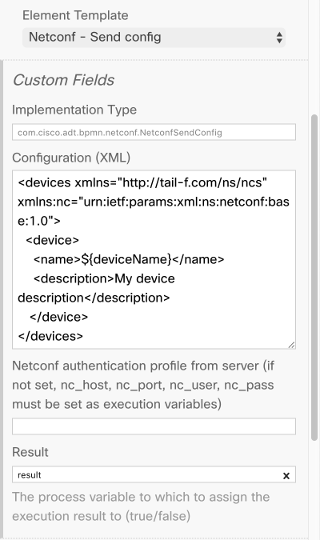

Send netconf configuration change requests.
Need to specify
- The xml payload containing the needed configuration
- The variable which will contain the success of applying the config
Please note that execution variables may be included in any of the fields like that: ${variableName}

### 3. Netconf - Send action

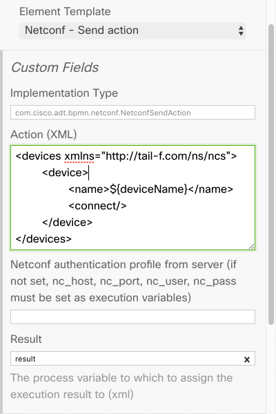

Calls a predefined NSO action
Need to specify
- The xml payload containing the action to becal led
- The variable which will contain the output of the action execution

4. NSO - Send CLI command (needs the karajan nso service)

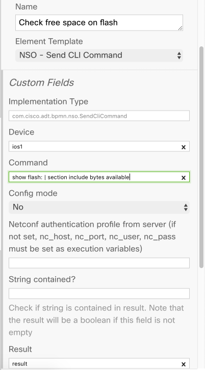

Sends a CLI command to the specified device over NSO. For this specific task the additional karajan NSO package is required. 
The NSO service makes an abstraction by receiving just the device name and, based on its type/NED uses the live status exec to send the
specified command to the device. For now cisco-ios, cisco-ios-xr, alu-sr, juniper-junos, redback-se are supported, but
the package can be extended to support other device types.
Need to specify
- The device to send the command to
- If the command to be send should be in config mode or not
- The variable which will contain the result of execution
Optionally the task can check if a specified string is contained in the returned result, and in
this case the execution result returned in the variable will be a boolean specifying if string is
contained or not. 

## Additional sample plugins

### 1. SSH - Send Command/Config
Send CLI commands to any SSH enabled server/devices. Has 3 ways of interacting with the
target server/device:
- Shell – send batch of shell commands and get the output

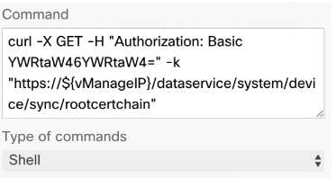

- Config – send batch of commands to a device and get the output

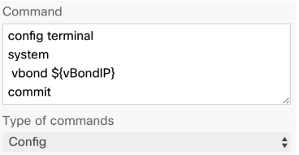

- Terminal – work in interactive mode, e.g. expect a string and send a specific answer. 

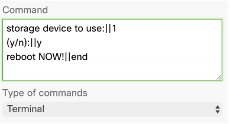

Please always identify the end of the execution and send an end to signal that the execution should end and the return value should be sent, otherwise the task will not wait for the last output
If the output of a command need to be included in the returned resutl, it needs to be specified by adding ||true at the end of the command, otherwise the command
will be executed but the ouptut will not be returned. Like: 
>prompt> ||ls -al||true

Need to specify
- SSH connection details (server, port, user, pass)
- Type of command (shell, config, terminal)
- The command(s) to be sent
- The variable which will contain the result of execution
Optionally the task can check if a specified string is contained in the returned result, and in this case the execution result returned
in the variable will be a boolean specifying if string is contained or not. 

### 2. HTTP - rest call (Unirest)

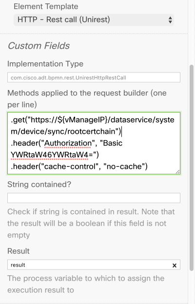

Sample plugin for making HTTP REST calls based on the Unirest java library, where each http method can be specified
on a separate line - can be also very easy exported from Postman

### 3. Kafka - Post Message

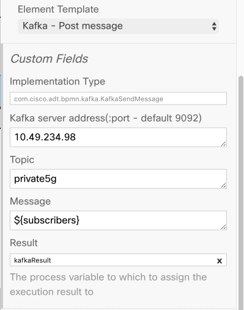

Sample plugin for posting a message to a kafka bus. 
Kafka address, port and topic need to be specified, as well as the message to be posted.
Note that the client ID is set as "Karajan" in the plugin code.

# Observations

Providing information to the plugins is done using execution variables and this might cause issues in camunda if any of these variables have a length which bigger than 4000 characters. This is caused by the fact that by default the db schema used 
by camunda uses a 4000 character limit for the fields which contain the execution variable values.

To overcome this limitation, several options are available:
- modify the db structure to allow longer variable values
for example if using mysql/mariadb as the camunda db, these are the changes that need to be performed:

>alter table  ACT_HI_DETAIL MODIFY TEXT_ varchar(65535);

>alter table  ACT_HI_DETAIL MODIFY TEXT2_ varchar(65535);

>alter table  ACT_RU_VARIABLE MODIFY TEXT_ varchar(65535);

>alter table  ACT_RU_VARIABLE MODIFY TEXT2_ varchar(65535);

>alter table  ACT_HI_VARINST MODIFY TEXT_ varchar(65535);

>alter table  ACT_HI_VARINST MODIFY TEXT2_ varchar(65535);

if however, using another db (like the default in-memory h2 used by camunda) specific steps need to be performed

- another option is to modify the plugins and to provide input as **field injections** 

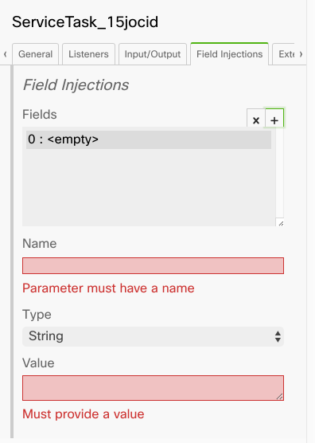

or as json objects, like we are doing with the return object (taskResult), where we have 1 object with 3 properties - code,value,detail
When using JSON objects with properties camunda saves the variable content in different tables/fields which do not have this limitation (BLOB).
The problem in the case of both field injections and JSON objectsis that the specific templates for the properties pane will no longer work in our web UI workflow management tool and you need to deal with low level variable setting instead of predefined input fields for each type of plugin

# Camunda modeler template file

A template file for Camunda Modeler is also provided under utils/camunda-modeler/resources/element-templates/bpmn_templates.json.
In order to install it, just copy the camunda-modeler folder under the Camunda Modeler User Data Direcotry, which is :

%APPDATA% on Windows

$XDG_CONFIG_HOME or ~/.config on Linux

~/Library/Application Support on macOS

and restart Camunda Modeler

